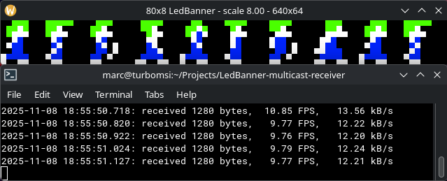

# LedBanner Multicast Receiver

A small C/SDL3 application that visualizes an 80x8 RGB565 LED banner from UDP multicast frames.

## What it does

- Opens an SDL3 window representing an 80x8 LED matrix (scaled for visibility).
- Listens on a multicast group for raw frames:
  - Default: 239.0.0.1:1565
  - Format: 80x8 pixels, RGB565, 2 bytes per pixel, 1280 bytes per frame.
- For each valid frame:
  - Decodes RGB565 to RGB.
  - Renders the pixels.
  - Logs simple stats (bytes, FPS, kB/s).

## Code structure

- [`config.h`](config.h:1)
  - Dimensions, multicast defaults, `AppConfig`, `DEFAULT_APPCONFIG`.
- [`display.h`](display.h:1) / [`display.c`](display.c:1)
  - SDL init and `draw_pixels_from_buffer(...)`.
- [`events.h`](events.h:1) / [`events.c`](events.c:1)
  - `handle_sdl_events(...)` (QUIT / ESC).
- [`multicast.h`](multicast.h:1) / [`multicast.c`](multicast.c:1)
  - `setup_multicast_socket(...)` for joining the multicast group.
- [`stats.h`](stats.h:1) / [`stats.c`](stats.c:1)
  - `StatsState`, logging of FPS / kB/s.
- [`main.c`](main.c:1)
  - Wires everything together:
    - init config + SDL
    - init multicast
    - event + receive + render loop
    - cleanup.

## Build

Requires:

- C compiler (POSIX-like environment).
- SDL3 development files.
- `pkg-config` (recommended).

Build and clean:

```sh
make
make clean
```

Resulting binary: `led80x8`.

## Run

```sh
./led80x8
```

- Expects 1280-byte RGB565 frames on the configured multicast address.
- Close window or press ESC to exit.
